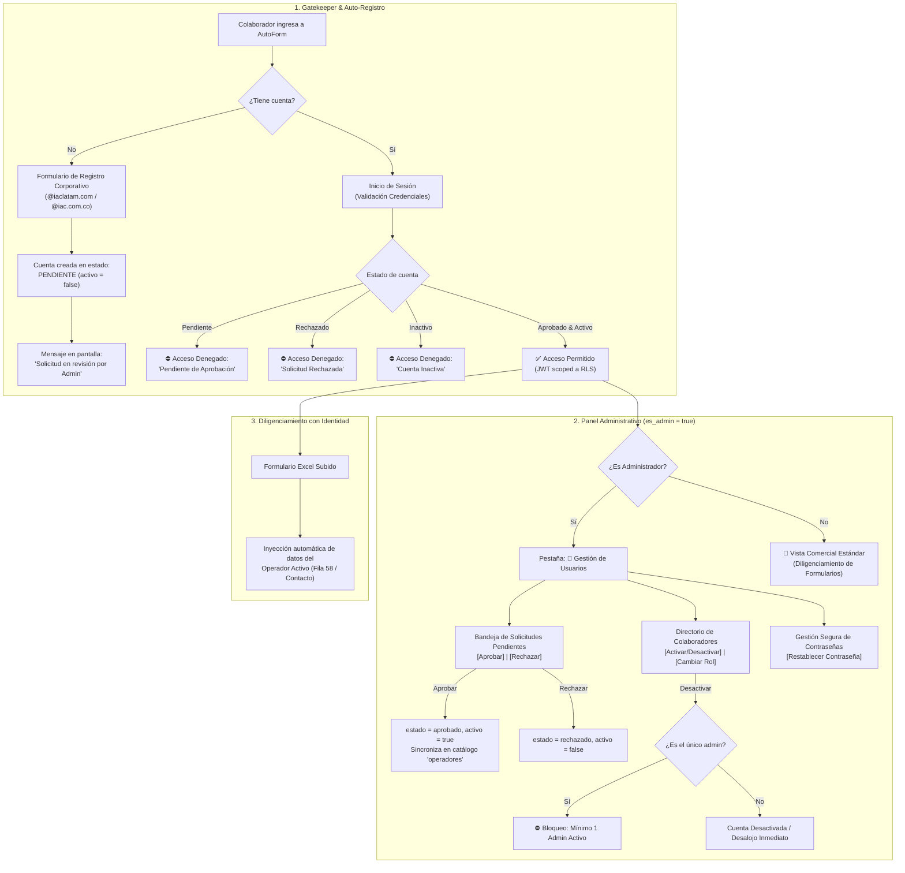

# Plan de Cierre de Staging: Auto-Registro Corporativo, Panel de Usuarios y Criterios de Merge a Main

Este documento establece la arquitectura, diseño funcional, estrategia de pruebas sintéticas y compuertas de calidad (Quality Gates) para el cierre formal de la fase **Staging** en AutoForm Excel, previo a la autorización de integración a la rama principal (`main`).

> **POLÍTICA DE SEGURIDAD ESTRICTA (ADR-0010):**
> - **No hacer merge a `main` todavía:** Todo el trabajo permanece confinado en la rama de desarrollo `project`.
> - **Cero mutación de proyectos Supabase reales:** No se realizarán llamadas destructivas ni alteraciones a las bases de datos de producción ni de staging mientras se define y aprueba este plan.
> - **Cero despacho de correos reales:** No se activarán envíos de correos SMTP a buzones reales; todas las validaciones de flujo se realizarán mediante pruebas sintéticas y mocks aislados.

---

## 1. Alcance de los Nuevos Flujos Corporativos

---

## 2. Especificación Técnica de los Componentes

### Componente A: Flujo de Auto-Registro con Aprobación Administrativa
1. **Captura de Datos en Gatekeeper (`app1.py`)**:
   - Campos: Nombre completo (`*`), Correo corporativo (`*`), Cargo/Rol funcional, Teléfono corporativo, Ciudad, Contraseña (`*`, mín. 8 caracteres) y Confirmación de contraseña.
   - Validación de dominios corporativos autorizados (`validar_dominio_corporativo`): Estrictamente `@iaclatam.com` y `@iac.com.co`.
2. **Ciclo de Vida de la Cuenta (`core/auth_manager.py`)**:
   - La cuenta se registra inicialmente con:
     * `estado_aprobacion = 'pendiente'`
     * `activo = False`
     * `es_admin = False` (imposibilidad de autoproclamación de privilegios).
   - En el Gatekeeper, tras enviar el formulario, **NO se realiza auto-login**. Se limpia el formulario y se despliega una notificación corporativa:
     > *"✅ Tu solicitud de acceso ha sido registrada exitosamente. Por motivos de seguridad institucional, un administrador corporativo debe verificar y autorizar tu cuenta antes del primer ingreso."*
3. **Bloqueo en el Inicio de Sesión**:
   - `iniciar_sesion` verifica el campo `estado_aprobacion`:
     * Si `estado_aprobacion == 'pendiente'`: Retorna `False`, sin tokens, con mensaje: *"Tu solicitud de acceso está en proceso de revisión por parte del administrador corporativo."*
     * Si `estado_aprobacion == 'rechazado'`: Retorna `False`, sin tokens, con mensaje: *"Tu solicitud de acceso fue rechazada. Contacta a gerencia o al administrador institucional."*
     * Si `activo == False`: Retorna `False`, con mensaje: *"Tu cuenta se encuentra inactiva o suspendida."*

---

### Componente B: Panel Centralizado de Gestión de Usuarios (`app1.py`)
Visible exclusivamente para usuarios con `es_admin == True` (determinado desde la base de datos, nunca desde cliente ni tokens no verificados).

1. **Sub-pestaña 1: Solicitudes de Registro Pendientes**:
   - Consulta reactiva vía `auth_manager.listar_solicitudes_pendientes(access_token)`.
   - Muestra tabla/tarjetas informativas: Nombre, Correo, Cargo, Teléfono, Ciudad, Fecha de Registro.
   - Acciones por usuario:
     * **Botón `[✅ Aprobar]`**: Invoca `auth_manager.aprobar_solicitud_registro(usuario_id, access_token)`. Cambia estado a `'aprobado'`, `activo = True` y crea/actualiza la ficha correspondiente en `operadores` vinculada a `usuario_id`.
     * **Botón `[❌ Rechazar]`**: Invoca `auth_manager.rechazar_solicitud_registro(usuario_id, access_token)`. Cambia estado a `'rechazado'`, `activo = False`.
2. **Sub-pestaña 2: Directorio de Colaboradores y Control de Acceso (RBAC)**:
   - Consulta el listado completo de usuarios corporativos.
   - Indicador visual de estado: 🟢 Activo | 🔴 Inactivo | 🛡️ Administrador | 💼 Asesor Comercial.
   - Acciones por colaborador:
     * **Conmutador Activar/Suspender**: Llama a `auth_manager.conmutar_estado_activo_usuario`. Si el colaborador desactivado tiene sesión abierta, el mecanismo de guarda de `app1.py` (líneas 586-594) lo desaloja de inmediato al siguiente ciclo de Streamlit.
     * **Asignar Rol (Comercial / Administrador)**: Llama a `auth_manager.cambiar_rol_usuario`.
     * **Salvaguarda de Singleton / Último Admin**: Si se intenta suspender o degradar al único administrador activo, la operación es rechazada con un error categórico: *"Operación denegada: No es posible desactivar ni revocar los privilegios del único administrador activo de la plataforma."*
3. **Sub-pestaña 3: Gestión Segura de Contraseñas Corporativas**:
   - Herramienta para que el Administrador restablezca la clave de un colaborador comercial ante olvido o bloqueo:
     * Campo para ingresar o generar contraseña temporal de alta entropía (mínimo 10 caracteres, mayúsculas, números y símbolos).
     * Ejecución vía `auth_manager.restablecer_password_comercial_admin(usuario_id, nueva_pwd, access_token)`.

---

### Componente C: Flujo y Política de Recuperación de Contraseña
Con base en la necesidad de mantener el Gatekeeper de Login libre de sobrecarga visual y protegido contra ataques de enumeración o abuso público:

1. **Mecanismo Primario (Asistido por Administrador)**:
   - Los colaboradores que olviden sus credenciales solicitan el reinicio a un administrador activo de IAC Latam.
   - El administrador utiliza el Panel de Usuarios para actualizar la credencial de forma segura e inmediata.
2. **Mecanismo Secundario (Auto-servicio Institucional Controlado)**:
   - Si se habilita el autoservicio en el Gatekeeper en una fase posterior:
     * El formulario solicita únicamente el correo corporativo.
     * Validación estricta anti-PDF: La URL de redirección no puede contener identificadores asociados a los proyectos de AutoForm PDF (`PROHIBITED_PROJECT_REFS`).
     * Respuesta homogénea garantizada: El sistema responde siempre *"Si tu correo está registrado, recibirás un enlace de restablecimiento"*, impidiendo determinar si un correo existe o no en la plataforma.
     * Tokens de un solo uso con ventana máxima de 15 minutos.

---

## 3. Suite de Pruebas Sintéticas de Extremo a Extremo (E2E)

Se implementará un archivo de pruebas dedicado: `tests/test_synthetic_e2e_staging.py` que no realiza ninguna mutación en bases de datos de producción ni despacha correos SMTP reales.

### Casos de Prueba E2E a Implementar:

| ID | Prueba Sintética | Procedimiento de Validación | Criterio de Éxito |
| :---: | :--- | :--- | :--- |
| **E2E-01** | **Auto-Registro con Estado Pendiente** | Se simula el registro de un nuevo colaborador `synth_colab_1@iaclatam.com`. | Registro exitoso, `estado_aprobacion == 'pendiente'`, `activo == False`, `es_admin == False`. |
| **E2E-02** | **Bloqueo de Login en Estado Pendiente** | Intento de `iniciar_sesion` con credenciales de la cuenta recién registrada en E2E-01. | Retorna `False`, tokens `None`, mensaje claro indicando aprobación pendiente. |
| **E2E-03** | **Aprobación Administrativa y Fusión de Operador** | Administrador verificado aprueba la solicitud mediante `aprobar_solicitud_registro`. | Estado muta a `'aprobado'`, `activo == True`, se crea fila sincronizada en tabla `operadores`. |
| **E2E-04** | **Login Exitoso tras Aprobación y Diligenciamiento** | El colaborador aprobado inicia sesión y ejecuta el pipeline de diligenciamiento en memoria. | Login entrega tokens válidos; la inyección asigna su nombre y cargo a los campos del comercial. |
| **E2E-05** | **Rechazo de Registro por Administrador** | Se registra `synth_colab_2@iaclatam.com` y el administrador ejecuta `rechazar_solicitud_registro`. | Estado muta a `'rechazado'`, `activo == False`; login subsiguiente bloqueado categóricamente. |
| **E2E-06** | **Desalojo en Caliente por Desactivación** | Colaborador con sesión activa es suspendido (`activo = False`) por el administrador. | En el siguiente chequeo de perfil, la sesión se revoca y el sistema exige reautenticación. |
| **E2E-07** | **Protección del Último Administrador Activo** | Intento administrativo de suspender o degradar al único usuario admin disponible. | Operación rechazada con error de singleton; el admin permanece activo e inmutable. |
| **E2E-08** | **Restablecimiento de Contraseña Administrativo** | Admin asigna nueva contraseña a colaborador mediante `restablecer_password_comercial_admin`. | La contraseña anterior es invalidada; login exitoso inmediato con la nueva credencial. |
| **E2E-09** | **Rechazo de Dominios Externos en 3 Capas** | Intento de registro con `@gmail.com`, `@outlook.com` y `@iac.com`. | Rechazado en capa UI, capa `auth_manager` y capa disparador SQL de base de datos. |
| **E2E-10** | **Barrera Anti-PDF en Flujo de Recuperación** | Invocación de recuperación con URLs que apunten a `tnhedxwbpqihlqbtzudt` o `nfsijcwkmcvtwsponqsw`. | Lanza `ConfiguracionInvalidaError`; aborta inmediatamente sin despachar enlaces. |

---

## 4. Criterios de Aceptación para Autorizar el Merge Staging → Main

Para autorizar formalmente el merge de la rama `project` hacia `main`, deberán cumplirse **todas y cada una** de las siguientes compuertas de calidad:

### 🚪 Compuerta 1: Aprobación Explícita del Usuario
- El usuario / Product Owner debe revisar y aprobar este plan de cierre sin reservas.
- Ninguna instrucción de merge se ejecutará de forma anticipada o autónoma.

### 🚪 Compuerta 2: Cobertura de Pruebas Automatizadas al 100%
- Ejecución limpia de la suite de remediación de seguridad:
  `python -m unittest tests/test_security_remediation.py` (**60/60 tests OK**).
- Ejecución limpia de la nueva suite sintética E2E:
  `python -m unittest tests/test_synthetic_e2e_staging.py` (**10/10 tests OK**).
- 0 fallos, 0 errores, 0 pruebas saltadas de forma espuria.

### 🚪 Compuerta 3: Incolumidad de los Proyectos de AutoForm PDF
- Verificación de que ninguna configuración en código, scripts o variables apunte a los identificadores restringidos de AutoForm PDF:
  * Producción PDF: `tnhedxwbpqihlqbtzudt`
  * Staging PDF: `nfsijcwkmcvtwsponqsw`
- Aislamiento total confirmado en `docs/environments.md`.

### 🚪 Compuerta 4: Integridad de Base de Datos y Teardown
- En Staging Supabase, la tabla `deployment_identity` debe mantener exactamente 1 registro (`application_code = 'autoform-excel'`, `environment = 'staging'`).
- Teardown de pruebas verificado: Ningún usuario o dato sintético de prueba debe quedar abandonado en la base de datos.

### 🚪 Compuerta 5: Validación de Llenado Excel en Plantillas Reales
- Verificación Celda por Celda en `FORMULARIO NADIR CRISTAR.xlsx`: **0 diferencias** respecto al estándar esperado (incluyendo referencias bancarias `D138`, `O138`, `AB138` y preservación de `'N/A'`).
- Verificación en `01 SC-COM-02-25.xlsx`: Inyección impecable de datos de comercial en Fila 58 y correo en Fila 26.

### 🚪 Compuerta 6: Higiene Criptográfica y de Secretos
- Confirmar que ningún archivo `.env`, llaves privadas, `service_role_key` o contraseñas en texto plano se encuentren rastreados en git (`git status` limpio y `.gitignore` estricto).

---

## 5. Matriz de Componentes y Tareas a Desarrollar

| Módulo | Archivo | Acción Planificada |
| :--- | :--- | :--- |
| **Backend Auth** | `core/auth_manager.py` | Ajustar `registrar_solicitud_corporativa` para que por defecto registre en estado `'pendiente'` y `activo = False`. Asegurar que `iniciar_sesion` bloquee pendientes y rechazados con mensajes corporativos. |
| **Frontend UI** | `app1.py` | 1. Modificar pestaña "Registrarse" del Gatekeeper: feedback claro de solicitud enviada (sin auto-login). 2. Agregar pestaña "👥 Gestión de Usuarios" visible solo para administradores (`es_admin == True`) con aprobación de pendientes, conmutador de activación, asignación de rol y reseteo de claves. 3. Mantener el login sin enlaces descontrolados de reseteo. |
| **Pruebas E2E** | `tests/test_synthetic_e2e_staging.py` | Implementar suite sintética con los 10 casos de prueba E2E descritos (mocks rigurosos, cero impacto en producción, cero correos reales). |
| **Documentación** | `docs/staging_closure_plan.md` | Persistir este plan formalizado en el repositorio para trazabilidad arquitectónica. |
