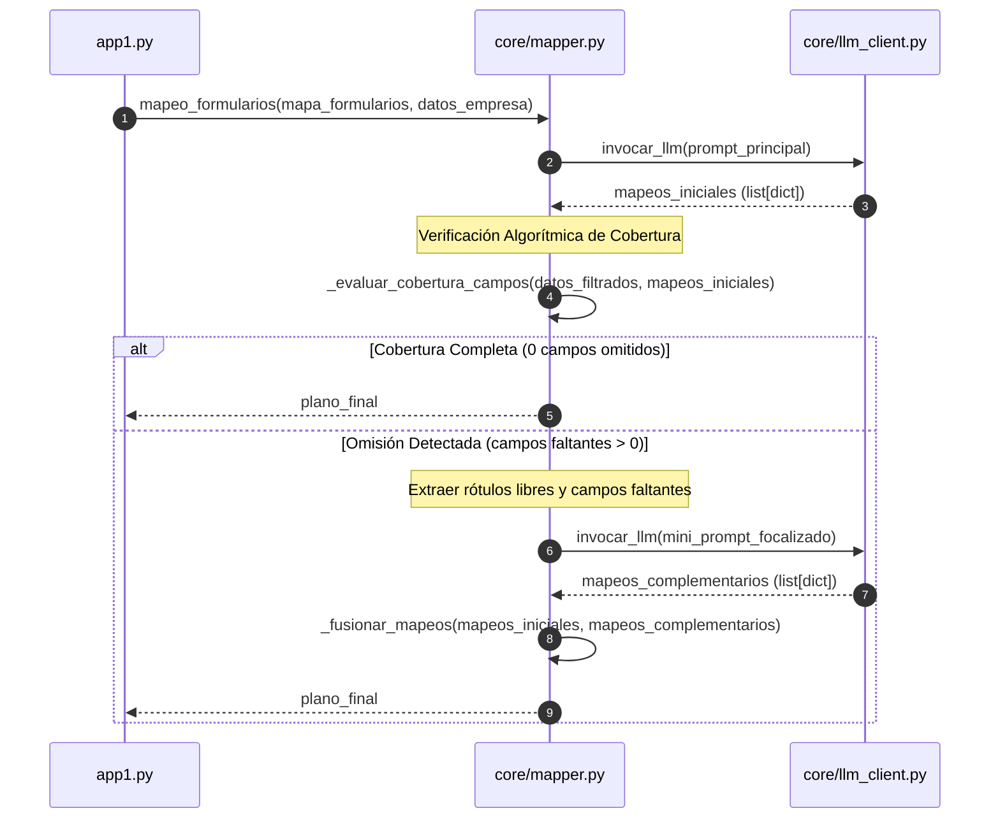

# Especificación de Diseño Técnico: Cobertura Total de Campos Corporativos (Fase 2)

- **Fecha**: 2026-08-06
- **Estrategia Seleccionada**: Enfoque 1 — Doble Verificación Post-Respuesta en Python + Re-consulta Focalizada.
- **Módulo Afectado**: [`core/mapper.py`](file:///c:/Users/Asus%20Vivobook%2016/Documents/GitHub/autoform-ai/core/mapper.py)

---

## 🎯 Objetivo

Garantizar que ningún campo de `DatosEmpresa` presente en la entrada sea ignorado u omitido durante el proceso de mapeo a Excel, si existe una ubicación válida en el formulario.

---

## 🏗️ Arquitectura y Flujo de Datos

El flujo de ejecución en `mapeo_formularios` se extiende con un paso de auditoría algorítmica y re-mapeo focalizado:

---

## 🔧 Componentes e Implementación

### 1. `_evaluar_cobertura_campos(datos_empresa_filtrados, mapeos_realizados)`
- **Propósito**: Comparar el conjunto de claves esperadas en `datos_empresa_filtrados` contra el conjunto de claves asignadas en `mapeos_realizados`.
- **Filtro de exclusión**: Ignorar campos que fueron explícitamente excluidos por reglas de negocio (ej. campos de suplente o referencias comerciales si la regla aplica).
- **Retorno**: Lista de claves de `DatosEmpresa` faltantes.

### 2. `_construir_mini_prompt_focalizado(rotulos_libres, campos_faltantes, datos_empresa)`
- **Propósito**: Construir un payload ultra-compacto enviando **únicamente**:
  - `campos_faltantes`: Diccionario recortado de `DatosEmpresa` con las claves no asignadas.
  - `rotulos_libres`: Subconjunto de rótulos del mapa de formularios que no han recibido ningún mapeo aún.
- **Ahorro de tokens**: < 300 tokens por consulta complementaria.

### 3. `_fusionar_mapeos(mapeos_iniciales, mapeos_complementarios)`
- **Propósito**: Unir ambas listas asegurando que no existan colisiones de celda `(hoja, fila, columna)`.

---

## 🧪 Plan de Verificación

### Pruebas Unitarias Automatizadas
- Probar `_evaluar_cobertura_campos` con diccionarios completos y parciales.
- Simular respuestas de omisión del LLM y verificar que el re-prompt recupera la cobertura completa.

### Verificación Manual / Integración
- Ejecutar procesamientos en `app1.py` con el formulario `FORMATO SAGRILAFT PROVEEDORES`.
- Confirmar en logs que no quedan campos críticos sin asignar cuando el rótulo existe en el Excel.
