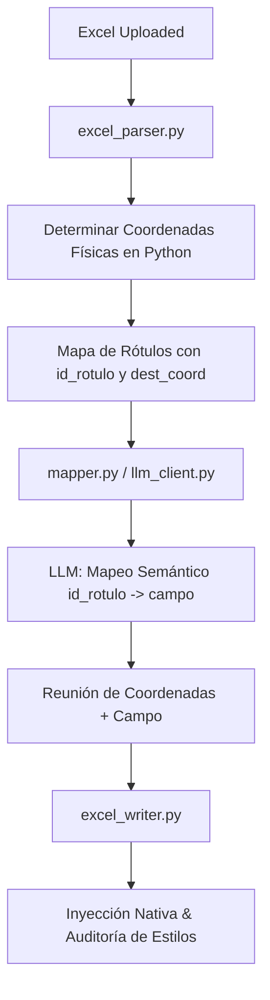

# Especificación de Diseño: Motor de Coordenadas Espacial Determinista en Excel

**Fecha:** 2026-08-11  
**Estado:** Aprobado  
**Enfoque:** Enfoque A (Determinación Geométrica en Python + Mapeo Semántico Desacoplado en LLM)

---

## 📌 Contexto y Objetivos

El cambio de modelo de IA hacia `gpt-4.1-mini` evidenció la fragilidad de delegar la decisión de coordenadas espaciales (`ubicacion`: `"derecha"`, `"abajo"`, `"misma"`) al modelo de lenguaje. Diferentes LLMs introducen variabilidad y sesgos espaciales sobre la cuadrícula de Excel.

Este diseño tiene como objetivo **desacoplar completamente las matemáticas espaciales de la inferencia de lenguaje**:
1. **Python** determina mecánicamente las coordenadas físicas de destino `(dest_fila, dest_col, dest_ubicacion, dest_celdas_merge)` analizando los bordes, celdas combinadas y disposición de la hoja.
2. **El LLM** realiza únicamente la asociación semántica entre el texto de la etiqueta y la clave canónica de `DatosEmpresa` (retornando `id_rotulo -> campo`).
3. **Garantía:** 0% de alucinación o extravío de coordenadas por parte de la IA.

---

## 🏗️ Arquitectura del Sistema



---

## 🔍 Componentes y Cambios Detallados

### 1. Extracción y Cálculo Espacial (`core/excel_parser.py`)

Para cada celda de etiqueta `(fila, col)` escaneada en el libro de Excel:

- **Asignación de Identificador Único:** Se genera un `id_rotulo` secuencial (ej. `1`, `2`, `3...`).
- **Regla 1 (Marcador Inline `misma`):**
  - Si `valor` contiene `_{2,}` o `\.{3,}`:
    - `dest_fila = fila`
    - `dest_col = col`
    - `dest_ubicacion = "misma"`
- **Regla 2 (Encabezado de Tabla / Fila de Secciones `abajo`):**
  - Si la fila actual contiene más de 1 etiqueta consecutiva y la fila inmediatamente inferior `(fila + 1, col)` está vacía con bordes/caja de tabla:
    - `dest_fila = fila + 1`
    - `dest_col = col`
    - `dest_ubicacion = "abajo"`
- **Regla 3 (Casilla Contigua por Defecto `derecha`):**
  - Si la celda derecha está vacía, con borde inferior o es un merge:
    - `dest_fila = fila`
    - `dest_col = col + 1` (o `rango_merge.max_col + 1` si el rótulo es un merge).
    - `dest_ubicacion = "derecha"`
- **Cálculo de Ancho de Merge (`dest_celdas_merge`):**
  - Python cuenta cuántas columnas continuas vacías/subrayadas hay a la derecha sin invadir rótulos adyacentes.

---

### 2. Mapeo Semántico Desacoplado (`core/mapper.py` & `core/llm_client.py`)

- **Payload Simplificado al LLM:**
  Se envía una estructura compacta:
  ```json
  {
    "F": [{"id": 1, "rotulo": "Razón Social o Nombre del Proveedor"}, {"id": 2, "rotulo": "NIT / Cédula"}],
    "D": {"razon_social": "IAC LATAM S.A.S.", "nit": "900.123.456-7"}
  }
  ```
- **Respuesta Estricta del LLM:**
  El LLM responde únicamente con la lista de parejas `id -> campo`:
  ```json
  [
    {"id": 1, "campo": "razon_social"},
    {"id": 2, "campo": "nit"}
  ]
  ```
- **Ensamblado Determinista en Python:**
  `mapper.py` cruza `id` con la estructura calculada en el paso 1 para construir el plan de inyección definitivo sin margen de error.

---

### 3. Inyección y Verificación Post-Escritura (`core/excel_writer.py`)

- Recibe el plan con coordenadas físicas fijas `(dest_fila, dest_col)`.
- Si `dest_celdas_merge > 1` y la plantilla no tenía merge pre-existente, combina las celdas de forma segura.
- Si la plantilla ya poseía un merge pre-existente, aplica los bordes, alineación centrada vertical/horizontal (`Alignment(vertical="center", wrap_text=True)`) y color de fondo en todas las sub-celdas del rango.
- **Paso de Auditoría:** Verifica que la celda de destino no haya sobreescrito ninguna etiqueta original.

---

## 🎯 Plan de Verificación

1. **Pruebas Unitarias Sintéticas (`scratch/test_deterministic_spatial.py`):**
   - Crear un libro de Excel de prueba con los 3 casos: inline `_____`, tablas con encabezado `abajo` y casillas contiguas `derecha`.
   - Ejecutar la extracción y verificar que Python asigna el `dest_col` y `dest_fila` correcto antes de llamar al LLM.
2. **Validación de Invocación LLM (`gpt-4.1-mini`):**
   - Confirmar que el LLM responde el JSON reducido con `id` y `campo` en menos de 0.5s.
3. **Validación Visual de Archivo Resultante:**
   - Comprobar que los campos de Excel no se solapen y mantengan sus estilos intactos.
