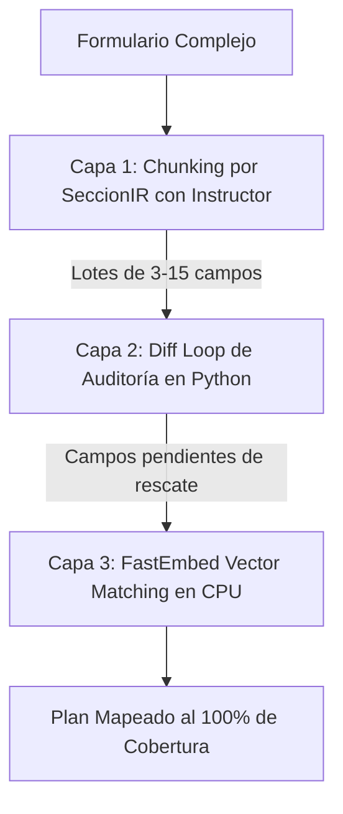

# Walkthrough: Tríada Zero-Omission Completa (Capa 1 + Capa 2 + Capa 3)

Implementación exitosa de las tres capas de la **Tríada Zero-Omission** en AutoForm AI para eliminar la omisión de campos intermedios, auditar diferencias y rescatar semánticamente cualquier dato mediante vectores locales en CPU.

---

## 1. Arquitectura de las 3 Capas

### A. [`core/llm_client.py`](file:///c:/Users/Asus%20Vivobook%2016/Documents/GitHub/autoform-ai/core/llm_client.py) (Capa 1)
* **Integración Nativa de Instructor**:
  * `obtener_cliente_instructor()`: Parchea el cliente oficial de `openai.OpenAI` o `openai.AzureOpenAI` con `instructor.from_openai`.
* **Inferencia Estructurada por Lotes**:
  * `consultar_llm_seccion_instructor(campos_seccion, taxonomia_d, titulo_seccion)`: Envía el lote específico de la sección (3 a 15 campos), valida contra el esquema Pydantic V2 `PlanMapeoSemantico` y aplica `max_retries=2` con reintentos automáticos transparentes si el LLM devuelve un formato erróneo.

### B. [`pipeline/stages/stage_3_llm_mapper.py`](file:///c:/Users/Asus%20Vivobook%2016/Documents/GitHub/autoform-ai/pipeline/stages/stage_3_llm_mapper.py) (Capa 1, 2 y 3)
* **`_construir_lotes_secciones_desde_ir(ctx)` (Capa 1)**:
  * Agrupa los campos viables por cada `SeccionIR` procesable manteniendo IDs globales correlacionados continuos.
* **`_ejecutar_diff_loop_seccion(...)` (Capa 2 & 3)**:
  * **Capa 2 (Diff Loop):** Bucle determinista en Python que calcula $\text{Omitidos} = \text{Viables} - \text{Mapeados}$ y aplica reglas de dominio.
  * **Capa 3 (FastEmbed):** Si aún quedan campos sin asignar, invoca `buscar_rescate_vectorial` para comparar la similitud coseno del vector del rótulo contra las descripciones taxonómicas del perfil.

### C. [`core/fastembed_matcher.py`](file:///c:/Users/Asus%20Vivobook%2016/Documents/GitHub/autoform-ai/core/fastembed_matcher.py) (Capa 3)
* Motor de embeddings semánticos local que corre en **CPU con ONNX Runtime (<5ms, costo $0 de API)** utilizando el modelo multilingüe cuantizado `sentence-transformers/paraphrase-multilingual-MiniLM-L12-v2`.
* Vectoriza y compara descripciones enriquecidas para emparejar sinónimos y paráfrasis complejas (ej. *"Lugar de Domicilio"* $\leftrightarrow$ *"direccion"*, *"Entidad Bancaria"* $\leftrightarrow$ *"banco"*).

---

## 2. Pruebas y Verificación

1. **Test Específico de FastEmbed ([`scratch/test_fastembed_rescue.py`](file:///c:/Users/Asus%20Vivobook%2016/Documents/GitHub/autoform-ai/scratch/test_fastembed_rescue.py)):**
   * ✅ Similitudes semánticas en CPU: *"Entidad Bancaria"* $\rightarrow$ `banco` (86.2%), *"Teléfono Móvil"* $\rightarrow$ `celular` (83.6%), *"Nombre o Razón Social"* $\rightarrow$ `razon_social` (73.2%).

2. **Test de Capa 1 y Capa 2 ([`scratch/test_instructor_chunking_diff_loop.py`](file:///c:/Users/Asus%20Vivobook%2016/Documents/GitHub/autoform-ai/scratch/test_instructor_chunking_diff_loop.py)):**
   * ✅ **Test 1:** Cliente Instructor $\rightarrow$ **100% OK**.
   * ✅ **Test 2:** Loteado de 16 secciones en `FMCA07J` (IDs 1..88 continuos) $\rightarrow$ **100% OK**.
   * ✅ **Test 3:** Diff Loop: detección de 2 campos omitidos y rescate automático $\rightarrow$ **100% OK**.

3. **Suite Completa de Regresión:**
   * `test_spatial_ir.py` $\rightarrow$ **35/35 OK** 🟢
   * `test_semantic_validator.py` $\rightarrow$ **48/48 OK** 🟢
   * `test_stage_3_hsp.py` $\rightarrow$ **21/21 OK** 🟢
   * `test_contextual_numero.py` $\rightarrow$ **13/13 OK** 🟢
   * `test_section_title_defense.py` $\rightarrow$ **100% OK** 🟢
   * `test_shaded_backgrounds.py` $\rightarrow$ **100% OK** 🟢
   * `test_user_form_e2e.py` $\rightarrow$ **100% OK** 🟢
